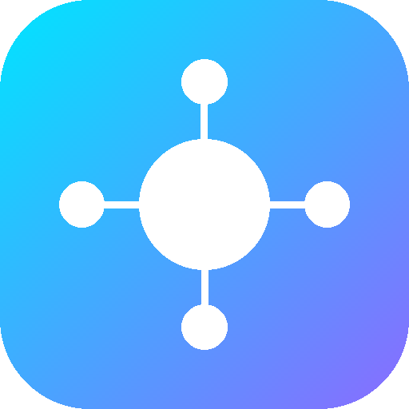

<div dir="rtl">

# 🌆 برنامه‌ریز هوشمند زندگی — Life Planner

<p align="center">
  
</p>

<p align="center">
  <b>سوپراپ مدیریت زمان، عادت‌ها، اهداف و تمرکز عمیق همراه با گیمیفیکیشن پیشرفته و بازی‌سازی زندگی</b><br>
  <i>ترکیبی از کارایی مدرن، طراحی چشم‌نواز فارسی (RTL)، بدون وابستگی (Zero Dependencies) و ۱۰۰٪ آفلاین‌محور (PWA)</i>
</p>

<p align="center">
  
  
  
  
  
</p>

---

🌐 Live Demo
https://karoangus.github.io/Life-Planner/
## 📌 فهرست مطالب

- [✨ نگاه کلی و تمایزها](#-نگاه-کلی-و-تمایزها)
- [🖼️ گالری تصاویر و پیش‌نمایش محیط برنامه](#️-گالری-تصاویر-و-پیشنمایش-محیط-برنامه)
- [⚡ خلاصه جامع امکانات و قابلیت‌ها](#-خلاصه-جامع-امکانات-و-قابلیتها)
  - [📋 مدیریت پیشرفته تسک‌ها و وظایف](#1--مدیریت-پیشرفته-تسکها-و-وظایف)
  - [🍅 موتور تمرکز و پومودورو حرفه‌ای](#2--موتور-تمرکز-و-پومودورو-حرفهای-focus-to-do-edition)
  - [🎮 اکوسیستم گیمیفیکیشن و بازی‌سازی زندگی](#3--اکوسیستم-گیمیفیکیشن-و-بازیسازی-زندگی-gamification--rpg)
  - [📅 تقویم تعاملی و زمان‌بندی هوشمند](#4--تقویم-تعاملی-و-زمانبندی-هوشمند)
  - [🔥 ردیاب عادت‌ها و زنجیره پایبندی](#5--ردیاب-عادتها-و-زنجیره-پایبندی-streaks)
  - [🎯 مدیریت اهداف چندسطحی](#6--مدیریت-اهداف-چندسطحی-multi-tier-goals)
  - [📝 دفترچه یادداشت سازمان‌یافته](#7--دفترچه-یادداشت-سازمانیافته)
  - [⚙️ شخصی‌سازی، تم‌ها و مقیاس رابط کاربری](#8--شخصیسازی-تمها-و-مقیاس-رابط-کاربری)
- [🏗️ معماری فنی و ساختار پروژه](#️-معماری-فنی-و-ساختار-پروژه)
- [🚀 راهنمای نصب و اجرای سریع](#-راهنمای-نصب-و-اجرای-سریع)
- [📱 راهنمای نصب به عنوان PWA](#-راهنمای-نصب-به-عنوان-pwa-روی-موبایل-و-دسکتاپ)
- [🧪 راهنمای تست و کنترل کیفیت](#-راهنمای-تست-و-کنترل-کیفیت)
- [🔢 راهنمای به‌روزرسانی و توسعه نسخه جدید](#-راهنمای-بهروزرسانی-و-توسعه-نسخه-جدید)
- [🆕 تاریخچه تغییرات نسخه‌های اخیر](#-تاریخچه-تغییرات-نسخههای-اخیر)
- [🌐 English Overview](#-english-overview)

---

## ✨ نگاه کلی و تمایزها

**Life Planner** فقط یک لیست ساده از کارهای روزمره نیست؛ این سیستم طراحی شده تا روزمرگی شما را به یک سفر هیجان‌انگیز RPG تبدیل کند:

1. **⚡ بدون هیچ وابستگی و بیلد (Zero Dependencies / Pure Vanilla):** کل برنامه با HTML5، CSS3 مدرن و جاوااسکریپت خام پیاده‌سازی شده؛ بدون کتابخانه‌های سنگین و بدون نیاز به هیچ ابزار بیلد (مانند Webpack یا Vite).
2. **🔒 امنیت و حریم خصوصی مطلق (Local-First):** تمامی داده‌ها درون `localStorage` مرورگر دستگاه کاربر ذخیره می‌شوند. هیچ داده‌ای به هیچ سروری ارسال نمی‌شود و هیچ ردیابی وجود ندارد.
3. **📴 کارکرد کاملاً آفلاین (Offline PWA):** به کمک Service Worker، بعد از اولین بارگذاری می‌توانید از برنامه حتی بدون دسترسی به اینترنت استفاده کنید.
4. **🎮 گیمیفیکیشن عمیق و اصولی:** با انجام کارها، XP کسب کنید، سطح (Level) خود را بالا ببرید، شهری به نام **Life City** بسازید، در برابر باس‌های هفتگی بجنگید و مهارت‌های جدید در درخت مهارت آزاد کنید.
5. **🇮🇷 طراحی استاندارد فارسی و راست‌به‌چپ (RTL):** تایپوگرافی، آیکون‌ها، تقویم و چیدمان‌ها با دقت بالا برای کاربران فارسی‌زبان بهینه‌سازی شده‌اند.

---

## 🖼️ گالری تصاویر و پیش‌نمایش محیط برنامه

<div align="center">

| 📱 داشبورد مرکزی (Command Center) | ✅ مدیریت تسک‌ها (Task Workflow) |
|:---:|:---:|
|  |  |
| *نمای کلی روز، پیشرفت کل، کوئست فعال و آمارهای کلیدی* | *فیلترهای وضعیتی، اولویت‌ها، زیرتسک‌ها و ددلاین‌ها* |

| 🍅 پومودورو و تمرکز عمیق (Deep Focus) | 🏙️ شهر مجازی من (Life City) |
|:---:|:---:|
|  |  |
| *چرخه‌های ۴ جلسه‌ای، پریست‌های سفارشی و صداهای محیطی آفلاین* | *رشد تمدن شخصی از چادر جنگلی تا کلان‌شهر سایبرپانک* |

| 🔥 ردیاب عادت‌ها و زنجیره (Habits Tracker) | 🎯 سیستم اهداف چندسطحی (Goals System) |
|:---:|:---:|
|  |  |
| *ثبت استریک پیاپی، محافظ زنجیره و ماتریس هفتگی* | *سطوح روزانه تا مادام‌العمر همراه با نوار پیشرفت هوشمند* |

| 🛍️ فروشگاه ارتقا و جوایز (XP Shop) |
|:---:|
|  |
| *خرید بوست‌های XP، محافظ استریک، تم‌های اختصاصی و Mystery Box* |

</div>

---

## ⚡ خلاصه جامع امکانات و قابلیت‌ها

### 1. 📋 مدیریت پیشرفته تسک‌ها و وظایف
- **تب‌های خلوت و کاربردی (جدید در v16):** نوار تب‌های بخش تسک‌ها به چهار تب *همه*، *شروع نشده*، *Inbox* و *تکمیل‌شده* کاهش پیدا کرده است؛ تب‌های *در حال انجام*، *در صف* و *متوقف* حذف شدند (وضعیت هر تسک همچنان از منوی جزئیات همان تسک قابل تغییر است).
- **تکمیل‌شده‌ها به شکل تب (جدید در v16):** تسک‌های انجام‌شده به‌جای یک بلوک همیشه‌باز در بالای صفحه، داخل تب «✅ تکمیل‌شده» با شمارنده‌ی زنده قرار گرفته‌اند تا فضای کارهای باز بیشتر شود.
- **چهار وضعیت کاری (Workflow States):** امکان دسته‌بندی تسک‌ها به وضعیت‌های *شروع‌نشده*، *در حال انجام*، *در صف* و *متوقف* از منوی جزئیات هر تسک.
- **رنگ‌بندی داینامیک وضعیت:** کارت‌های تسک در صفحه تسک‌ها و بخش «برنامه امروز» در داشبورد بر اساس وضعیت خود رنگ‌آمیزی می‌شوند (سبز برای در حال انجام، آبی برای در صف، نارنجی برای متوقف).
- **سیستم زیرتسک‌های سلسله‌مراتبی (Subtasks):** تعریف چندین ریزتسک برای هر تسک اصلی همراه با نمایش پیشرفت درصدی؛ تیک خوردن تمام زیرتسک‌ها به صورت خودکار تسک مادر را تکمیل می‌کند.
- **ددلاین‌های ترکیبی و چندگانه (Additional Deadlines):** پشتیبانی از چند ددلاین برای پروژه‌های چندمرحله‌ای و حضور خودکار در برنامه امروز داشبورد.
- **انتخابگر تصادفی تسک (Random Task Picker):** رفع قفل ذهنی و اهمال‌کاری با انتخاب هوشمند و رندوم یکی از تسک‌های باز متناسب با فیلتر فعال.
- **اینباکس سریع (Quick Inbox):** ثبت فوری ایده‌ها و کارها در چند ثانیه و دسته‌بندی و تعیین جزئیات در زمان مناسب.
- **منوی اکشن کامل:** مشاهده سریع پاداش‌های XP، اولویت، دسته، زمان تخمینی و یادداشت تسک با یک لمس ساده.

### 2. 🍅 موتور تمرکز و پومودورو حرفه‌ای (Focus To-Do Edition)
- **ساختار دوره‌ها و جلسات (Cycles & Sessions):** سازمان‌دهی چرخه‌های تمرکز به صورت جلسات ۴ تایی همراه با نقطه‌های بصری (🍅 🍅 ⚪ ⚪).
- **پریست‌های متنوع و منعطف:**
  - *کلاسیک:* ۲۵ دقیقه تمرکز / ۵ دقیقه استراحت
  - *دیپ فوکوس (Deep Focus):* ۶۰ دقیقه تمرکز عمیق / ۱۵ دقیقه استراحت
  - *مطالعه:* ۴۵ دقیقه تمرکز / ۱۰ دقیقه استراحت
  - *کوتاه:* ۱۵ دقیقه تمرکز / ۳ دقیقه استراحت
  - *پریست سفارشی:* تنظیم دلخواه دقایق تمرکز و استراحت با ذخیره دائم در حافظه.
- **استراحت طولانی خودکار (Long Break):** ورود خودکار به استراحت طولانی ۱۵ دقیقه‌ای پس از اتمام هر دوره کامل ۴ جلسه‌ای.
- **حالت تمرکز تمام‌صفحه سینمایی (Full-Screen Zen Focus):** محیطی کاملاً بدون حواس‌پرتی با تایمر دقیق، ساعت زنده و کنترل‌های سریع.
- **سیستم صداهای محیطی آفلاین (Ambient Soundscapes):**
  - 🌧️ باران و رعد آرام
  - 🌲 جنگل و چهچهه پرندگان
  - ☕ فضای کافه دنج
  - 🌊 امواج ملایم اقیانوس
  - 🔥 آتش هیزمی و شومینه
  - ⏰ تیک‌تاک ساعت مکانیکی
  - 🌌 فضای تمرکز عمیق (Deep Space)
  - همراه با اسلایدر تنظیم بلندی صدا و پخش پیوسته و بدون وقفه.
- **پیوند تایمر به تسک فعال:** انتخاب تسک هنگام شروع تمرکز و امکان ثبت فوری انجام تسک بلافاصله پس از اتمام تایمر.
- **آمار تحلیلی و هشدار زنده:** نمایش زمان تمرکز به صورت ساعت و دقیقه، میانگین فوکوس روزانه، اعلان‌های معکوس زنده و زنگ هشدار دوضربی پایان جلسه همراه با ویبره گوشی.

### 3. 🎮 اکوسیستم گیمیفیکیشن و بازی‌سازی زندگی (Gamification & RPG)
- **🏙️ شهر هوشمند من (Life City):**
  - شهری که با افزایش بهره‌وری و سطح شما تکامل می‌یابد:
    1. لول ۱: چادر توی جنگل 🏕️
    2. لول ۵: کلبه چوبی 🏡
    3. لول ۱۵: خانه واقعی 🏠
    4. لول ۳۰: خانه با ماشین 🚗
    5. لول ۵۰: خانه با باغچه و سگ 🌳
    6. لول ۸۰: شهر کوچک 🏙️
    7. لول ۱۰۰: کلان‌شهر سایبرپانک و آینده 🌆
  - گرافیک وکتوری پرجزئیات همراه با چرخه زنده روز، شب و باران، و صدای محیطی واقعی شهر.
  - نشستن اشیای تزئینی Mystery Box (درخت، نیمکت، چراغ نئونی، فواره و برج) درون محیط شهر.
- **⚔️ باس فایت هفتگی (Weekly Boss Battles):** تبدیل اهداف بزرگ هفته به یک نبرد حماسی با نوار سلامتی (HP)؛ وارد کردن ضربه به باس با تکمیل تسک‌های متصل و مهلت ۱۴ روزه برای شکست نهایی.
- **🌳 درخت مهارت (Skill Tree):** ارتقای مهارت‌های دائمی با امتیازهای مهارت دریافتی در هر لول‌آپ:
  - *استاد فوکوس:* افزایش درصدی XP جلسات پومودورو
  - *شکارچی کوئست:* افزایش XP مأموریت‌های تصادفی
  - *چانه‌زن:* تخفیف روی تمامی اقلام فروشگاه XP
  - *شانس بلند:* شانس دریافت جعبه شگفت‌انگیز رایگان
  - *قاتل بحران:* پاداش مضاعف برای حل تسک‌های حالت بحران
  - *محافظ استریک:* دریافت مستقیم Streak Shield رایگان
  - *کوئست سریع:* کاهش زمان انتظار کوئست‌های تصادفی (از ۲۰ به ۱۷ دقیقه)
- **🪞 رقابت با خود دیروز (You VS You):** سیستم هوشمند مقایسه عملکرد امروز با بهترین رکورد ثبت‌شده شخصی و مقایسه هفته جاری با هفته پیشین.
- **🛍️ فروشگاه جوایز (XP Shop):**
  - *XP Boost:* دو برابر شدن تمام XPهای دریافتی به مدت ۳۰ دقیقه
  - *Mystery Box:* جعبه شگفت‌انگیز حاوی XP جکپات و آیتم‌های جدید برای شهر
  - *Streak Shield (سپر استریک):* محافظت از قطع شدن زنجیره عادت‌ها در روزهای فراموش‌شده با قوانین ضد اسپم (سقف خرید هفتگی حداکثر ۳ عدد و نگهداری ۱ عدد در هر زمان).
- **⚡ مأموریت‌های تصادفی روزانه (Quests):** پیشنهاد مأموریت‌های روزانه با درجات سختی متنوع (Easy تا Special) و پاداش فوری.
- **🌟 جشن روز طلایی (Perfect Day):** جشن بصری ویژه و دریافت پاداش مضاعف در صورت تکمیل ۱۰۰٪ مأموریت‌ها و برنامه‌های روز.
- **🚨 حالت بحران (Crisis Mode):** فعال‌سازی پوسته هشدار اضطراری و شمارش معکوس زمانی که کارهای حیاتی عقب افتاده‌اند.

### 4. 📅 تقویم تعاملی و زمان‌بندی هوشمند
- تقویم جلالی (شمسی) و میلادی کامل و دقیق.
- **کشیدن و رها کردن رویدادها (Drag & Drop):** تغییر زمان یا روز رویدادها با نگه‌داشتن و کشیدن در شبکه هفتگی، همراه با اسنپ ۱۵ دقیقه‌ای و بررسی تداخل ساعت‌ها.
- **مدیریت پیشرفته رویدادهای چندروزه:** امکان ویرایش تکیِ فقط یک روز خاص از یک رویداد زنجیره‌ای، یا ویرایش سراسری کل روزها.
- دسته‌بندی‌های رنگی رویدادها و وظایف با پالت رنگ‌های جذاب.

### 5. 🔥 ردیاب عادت‌ها و زنجیره پایبندی (Streaks)
- **ویرایش عادت (جدید در v16):** با دکمه‌ی «✏️» روی هر کارت عادت می‌توانی نام و ایموجی آن را تغییر بدهی؛ زنجیره و تاریخچه‌ی تیک‌ها دست‌نخورده می‌ماند.
- ثبت و دنبال کردن زنجیره روزانه (Current Streak & Best Streak).
- ماتریس هفتگی بصری وضعیت تکمیل عادات.
- محافظت خودکار از زنجیره‌ها به کمک Streak Shield در صورت فعال بودن.

### 6. 🎯 مدیریت اهداف چندسطحی (Multi-Tier Goals)
- تعریف هدف در ۵ افق زمانی: *روزانه*، *هفتگی*، *ماهانه*، *سالانه* و *مادام‌العمر*.
- **گام‌های دقیق پیشرفت (جدید در v16):** در کنار دکمه‌های «-۱۰٪» و «+۱۰٪» حالا دکمه‌های «-۲٪» و «+۲٪» هم وجود دارند تا پیشرفت اهداف را دقیق‌تر ثبت کنی.
- **ویرایش هدف (جدید در v16):** با دکمه‌ی «✏️» روی هر کارت هدف می‌توانی عنوان، سطح و درصد پیشرفت آن را ویرایش کنی.
- سیستم ثبت نقاط عطف (Milestones) و محاسبه خودکار درصد پیشرفت کلی اهداف.

### 7. 📝 دفترچه یادداشت سازمان‌یافته
- یادداشت‌برداری سریع و بدون تأخیر.
- قابلیت سنجاق کردن (Pin) یادداشت‌های مهم به بالای لیست.
- دسته‌بندی موضوعی با برچسب و جستجوی لحظه‌ای.

### 8. ⚙️ شخصی‌سازی، تم‌ها و مقیاس رابط کاربری
- **۵ تم بصری متنوع:**
  - 🌙 تم تاریک پیش‌فرض (Dark)
  - ☀️ تم روشن (Light)
  - 💜 بنفش نئون (Neon Purple)
  - 🌇 غروب آتشین (Fire Sunset)
  - 👑 طلایی افسانه‌ای (Legendary Gold)
- **🌐 انتخاب زبان برنامه (جدید در v15):** زبان پیش‌فرض **فارسی (RTL)** است و از مسیر **تنظیمات ← «🌐 زبان برنامه»** می‌توان کل رابط را به **English (LTR)** تغییر داد. داده‌های نوشته‌شده توسط کاربر هرگز ترجمه نمی‌شوند.
- **تنظیم مقیاس رابط کاربری و فونت:** امکان کوچک یا بزرگ کردن سایز متون و عناصر به تناسب ابعاد صفحه گوشی یا مانیتور.
- **سفارشی‌سازی نوار پایین:** افزودن و چیدمان دلخواه دکمه‌های پرکاربرد به نوار دسترسی سریع.
- **پشتیبان‌گیری خودکار و دستی:** تولید فایل خروجی JSON از تمامی داده‌ها، بازیابی آسان و سیستم یادآوری و بکاپ‌گیری خودکار روزانه.
- **لودینگ اسکلتی و انیمیشن اسکرول (جدید در v16):** به‌جای اسپینر تمام‌صفحه، تا آماده شدن داده‌ها «اسکلت» خاکستری همان آیتم‌ها نمایش داده می‌شود و آیتم‌هایی که به سمتشان اسکرول می‌کنی با انیمیشن ملایم از پایین بالا می‌آیند.
- **حالت سبک برای گوشی‌های ضعیف (جدید در v16):** روی دستگاه‌های کم‌قدرت، سایه و گرادیان تزئینی ردیف‌های تکراری و رندر ردیف‌های بیرون از صفحه بهینه می‌شود؛ چیدمان، رنگ‌ها و همه‌ی دکمه‌ها دقیقاً مثل قبل می‌مانند.

---

## 🏗️ معماری فنی و ساختار پروژه

ساختار پروژه کاملاً تمیز، ماژولار و بدون نیاز به هیچ کامپایلر یا باندلری طراحی شده است:

```
Life-Planner/
│
├── index.html                  # بدنه اصلی برنامه (ساختار صفحات، مودال‌ها و چیدمان PWA)
├── app-version.json            # تک‌منبع نسخه برنامه جهت بررسی خودکار آپدیت
├── manifest.json               # مانیفست PWA برای نصب روی موبایل و دسکتاپ
├── sw.js                       # Service Worker برای کش آفلاین و مدیریت به‌روزرسانی
├── icon-192.png / icon-512.png # آیکون‌های استاندارد رزولوشن بالا برای PWA
│
├── css/
│   └── app.css                 # استایل‌های برنامه، تم‌های ۵ گانه و انیمیشن‌های RTL
│
├── js/
│   ├── core.js                 # هسته مرکزی: DB لوکال، رندرینگ، گیمیفیکیشن و تسک‌ها
│   ├── pomodoro.js             # ماژول مستقل پومودورو، صداهای امبینت و حالت ذن
│   ├── enhancements.js         # ماژول تنظیمات، مدیریت تم‌ها، مقیاس UI و بکاپ
│   ├── lang.js                 # لایه زبان: فارسی پیش‌فرض + ترجمه رابط به انگلیسی
│   └── sw-register.js          # رجیستر هوشمند Service Worker و مدیریت آپدیت‌ها
│
├── audio/                      # فایل‌های صوتی باکیفیت آفلاین (باران، کافه، جنگل، شهر)
├── docs/screenshots/           # تصاویر و اسکرین‌شات‌های مستندات برنامه
├── tests/
│   └── app.test.mjs            # تست‌های اعتبارسنجی کارکردی و دود (Smoke Tests)
└── ci/
    └── test.yml                # پایپ‌لاین CI/CD آماده برای GitHub Actions
```

> ⚠️ **نکته برای توسعه‌دهندگان:** ترتیب بارگذاری اسکریپت‌ها در `index.html` حیاتی است:  
> `core.js` ➔ `enhancements.js` ➔ `sw-register.js` ➔ `pomodoro.js` ➔ `lang.js`
>
> `lang.js` عمداً **آخرین** فایل است: این ماژول هیچ منطقی را تغییر نمی‌دهد و فقط متن‌های
> رابط کاربری را که روی صفحه آمده‌اند ترجمه می‌کند (با `MutationObserver`). به همین دلیل
> شناسه‌ها (ID)، کلاس‌ها و هندلرهای دکمه‌ها کاملاً دست‌نخورده باقی می‌مانند.

---

## 🚀 راهنمای نصب و اجرای سریع

از آنجا که این پروژه کاملاً استاتیک و بدون بیلد است، به دو روش می‌توانید آن را اجرا کنید:

### روش ۱ — اجرای محلی (Local):
کافی است فایل `index.html` را در مرورگر خود باز کنید.  
*(برای دسترسی کامل به قابلیت‌های PWA، نوتیفیکیشن‌ها و وب‌ورکرها، پیشنهاد می‌شود از یک سرور محلی سبک استفاده کنید:)*

```bash
# با استفاده از Node.js
npx serve .

# یا با استفاده از پایتون
python3 -m http.server 8080
```
سپس آدرس `http://localhost:8080` را در مرورگر باز کنید.

### روش ۲ — انتشار رایگان روی GitHub Pages:
1. این مخزن را در اکانت گیت‌هاب خود Fork یا Push کنید.
2. به بخش **Settings** > **Pages** در ریپازیتوری خود بروید.
3. در قسمت **Source**، شاخه `main` و مسیر `/ (root)` را انتخاب کرده و روی **Save** کلیک کنید.
4. آدرس برنامه به صورت `https://<username>.github.io/Life-Planner` در دسترس خواهد بود.

---

## 📱 راهنمای نصب به عنوان PWA (روی موبایل و دسکتاپ)

این برنامه یک **Progressive Web App (PWA)** کامل است و می‌تواند مثل یک اپلیکیشن بومی روی گوشی شما نصب شود:

- **📱 در گوشی‌های اندروید (Chrome / Edge):** سایت را باز کنید، روی منوی سه نقطه (⋮) مرورگر ضربه بزنید و گزینه **«نصب برنامه» (Install app)** یا **«افزودن به صفحه اصلی» (Add to Home screen)** را انتخاب کنید.
- **🍏 در گوشی‌های آیفون و آیپد (Safari):** سایت را در مرورگر سافاری باز کنید، روی دکمه‌ی Share (آیکون اشتراک‌گذاری در پایین صفحه) بزنید و گزینه **«Add to Home Screen»** را انتخاب نمایید.
- **💻 در کامپیوتر و لپ‌تاپ (Chrome / Edge):** در نوار آدرس مرورگر روی آیکون نصب (کامپیوتر کوچک در سمت راست نوار آدرس) کلیک کنید.

---

## 🧪 راهنمای تست و کنترل کیفیت

این پروژه دارای یک سوئیت تست کارکردی مستقل است که بارگذاری ساختار، ایجاد تسک، ثبت پیشرفت، محاسبات XP و سلامت رندر تمامی صفحات را بررسی می‌کند:

```bash
# اجرای تست‌ها
npm test
```

این تست‌ها در محیط CI گیت‌هاب نیز روی هر Push یا Pull Request اجرا می‌شوند.

---

## 🔢 راهنمای به‌روزرسانی و توسعه نسخه جدید

هنگام توسعه ویژگی‌های جدید و انتشار نسخه جدید، شماره نسخه باید در **هر پنج جا با هم** ارتقا پیدا کند تا کاربرها به‌طور خودکار پیام به‌روزرسانی بگیرند:

1. فایل `app-version.json` ➔ کلید `"version"` (مثلاً `"16.1"`).
2. فایل `js/core.js` ➔ `const LP_APP_VERSION = '16.1';`
3. فایل `package.json` ➔ کلید `"version"` (مثلاً `"16.1.0"`).
4. فایل `README.md` ➔ نشان نسخه در بالای صفحه و بخش تاریخچه تغییرات.
5. فایل `sw.js` ➔ ارتقای نام کش:
   ```javascript
   const CACHE_NAME = 'life-planner-cache-v64';
   ```

> ✅ پیش از باز کردن Pull Request حتماً `npm ci` و سپس `npm test` را اجرا کنید؛ هر ۱۲ تست باید سبز باشند.

---

## 🆕 تاریخچه تغییرات نسخه‌های اخیر

### ✨ نسخه 16.1
- 🗂️ **تب‌های ساده‌تر بخش تسک‌ها:** تب‌های «▶️ در حال انجام»، «📥 در صف» و «⏸️ متوقف» حذف شدند. نوار تب‌ها حالا فقط «📁 همه»، «⬜ شروع نشده»، «📥 Inbox» و «✅ تکمیل‌شده» است. وضعیت یک تسک همچنان از منوی جزئیات خودش قابل تغییر است.
- ✅ **تکمیل‌شده‌ها به شکل تب:** بلوک همیشه‌باز «تکمیل‌شده» از بالای صفحه برداشته شد و به تب «✅ تکمیل‌شده» با شمارنده‌ی زنده تبدیل شد.
- 🦴 **لودینگ اسکلتی (Skeleton):** به‌جای اسپینر روی کل صفحه، تا آماده شدن لیست‌ها اسکلت خاکستری و چشمک‌زنِ همان آیتم‌ها نمایش داده می‌شود — هم در لحظه‌ی باز شدن برنامه و هم هنگام جابه‌جایی بین بخش‌ها.
- 🪄 **انیمیشن اسکرول:** آیتم‌هایی که به سمتشان اسکرول می‌کنی با انیمیشن ملایم از پایین بالا می‌آیند. آیتم‌هایی که از قبل داخل صفحه هستند نه — یعنی با هر تیک زدن، لیست جلوی چشمت دوباره انیمیشن نمی‌گیرد.
- ⚡ **کاهش لگ روی گوشی‌های ضعیف:** رندرهای تکراریِ پشت‌سرهم در یک فریم ادغام شدند، ردیف‌های بیرون از صفحه دیگر رندر نمی‌شوند (`content-visibility`) و روی دستگاه‌های کم‌قدرت گرادیان و سایه‌ی تزئینی ردیف‌ها حذف می‌شود. ظاهر برنامه و همه‌ی دکمه‌ها بدون تغییر مانده‌اند.
- 🎯 **گام‌های ±۲٪ در اهداف:** در کنار «-۱۰٪» و «+۱۰٪» حالا دکمه‌های «-۲٪» و «+۲٪» هم اضافه شده‌اند.
- ✏️ **ویرایش عادت و هدف:** روی هر کارت عادت و هر کارت هدف یک دکمه‌ی «✏️» اضافه شد؛ عنوان، ایموجی، سطح و درصد پیشرفت قابل ویرایش هستند و سابقه‌ی روزهای تیک‌خورده حفظ می‌شود.
- 🌐 **ترجمه‌ی انگلیسی کامل:** همه‌ی متن‌های جدید (تب تکمیل‌شده، ویرایش عادت/هدف، پیام‌های ذخیره) در حالت English هم انگلیسی نمایش داده می‌شوند.

### 🌐 نسخه 15.0
- 🌐 **پشتیبانی از زبان انگلیسی:** زبان پیش‌فرض برنامه همچنان **فارسی (RTL)** است، اما حالا از مسیر **تنظیمات ← «🌐 زبان برنامه»** می‌توانی کل رابط کاربری را به **English (LTR)** تغییر بدهی.
- 🔒 **داده‌های تو دست‌نخورده می‌ماند:** فقط متن‌های خودِ برنامه ترجمه می‌شوند؛ عنوان تسک‌ها، یادداشت‌ها، عادت‌ها، اهداف، رویدادها و دسته‌بندی‌هایی که خودت نوشته‌ای هرگز ترجمه نمی‌شوند.
- ↔️ **چیدمان خودکار RTL/LTR:** با انتخاب انگلیسی، جهت صفحه به LTR تغییر می‌کند و فاصله‌ها و حاشیه‌های جهت‌دار متناسب می‌شوند؛ هر ۵ تم دقیقاً مثل قبل کار می‌کنند.
- 📅 **تاریخ شمسی به انگلیسی:** تاریخ همچنان شمسی می‌ماند و فقط نام ماه و روز هفته انگلیسی نوشته می‌شود (مثلاً `Wednesday, 18 Shahrivar 1405`).
- 💾 **ماندگاری انتخاب زبان:** زبان انتخابی در همان دستگاه ذخیره می‌شود و بعد از بستن برنامه هم حفظ می‌شود.

### 🌟 نسخه 14.1
- 🎨 **رنگ‌بندی تسک‌ها در «برنامه امروز» داشبورد:** تسک‌های برنامه امروز در داشبورد اکنون مطابق با وضعیت خود (در حال انجام: سبز، در صف: آبی، متوقف: نارنجی، شروع‌نشده: خاکستری) رنگ‌آمیزی می‌شوند.

### 🛡️ نسخه 14.0
- 🛡️ **بازطراحی Streak Shield:** افزایش قیمت به ۵۰۰ XP همراه با محدودیت منطقی نگهداری حداکثر ۱ عدد و سقف خرید ۳ عدد در هفته برای حفظ تعادل بازی.
- ⚔️ **مهلت ۱۴ روزه باس هفتگی:** محدودیت زمانی ۱۴ روزه برای شکست باس هفتگی جهت ایجاد انگیزه و چالش واقعی.
- 🎨 **کارت‌های تسک رنگی:** تمایز بصری سریع وضعیت هر تسک بر اساس کدهای رنگی استاندارد.
- ✅ **بخش اختصاصی تکمیل‌شده‌ها:** دسته‌بندی مجزا و خلوت‌تر برای تسک‌های انجام‌شده.

### ⏱️ نسخه 13.2 و 13.1
- 📌 **تثبیت نوار پایین و رفع پرش اسکرول:** ارتقای روانی اسکرول بدون هیچ لگ روی گوشی‌های ضعیف‌تر.
- ⏱️ **شمارشگر زنده پومودورو:** محاسبه و نمایش ثانیه‌به‌ثانیه‌ی دقیق «دقیقه X از Y» در حالت عادی و تمرکز عمیق.
- 📋 **همگام‌سازی لحظه‌ای داشبورد:** به‌روزرسانی آنی تغییرات تسک‌ها در داشبورد بدون نیاز به رفرش.
- 🔔 **زنگ هشدار واقعی پومودورو:** زنگ دوضربی رسا همراه با ویبره در انتهای هر جلسه تمرکز.

---

<p align="center">
  ساخته شده با ❤️ برای افزایش بهره‌وری، تمرکز و رشد شخصی فارسی‌زبانان
</p>

</div>

---

## 🌐 English Overview

<div dir="ltr">

# 🌆 Smart Life Planner (PWA)

**Life Planner** is a modern, high-performance, fully offline personal productivity suite and gamified life RPG built with pure Vanilla JavaScript, modern CSS3, and HTML5 (Zero Dependencies).

### 🚀 Key Highlights
- **🦴 Skeleton loading + scroll reveal (new in v16):** Lists show shimmering skeleton rows while they are being built instead of a full-screen spinner, and rows you scroll down to slide up into place. Rows already on screen never re-animate, so ticking a task cannot flicker.
- **⚡ Low-end phone mode (new in v16):** Consecutive renders are coalesced into a single frame, off-screen rows are skipped with `content-visibility`, and on small devices the decorative gradients/shadows on repeated rows are flattened — same layout, same colors, same buttons.
- **✏️ Editable habits & goals (new in v16):** Every habit card and goal card has an ✏️ button. Goal progress also got fine-grained **-2% / +2%** buttons next to the existing -10% / +10%.
- **🌐 Persian by default, English on demand (new in v15):** The interface ships in **Persian (RTL)** as the default language. Open **Settings → «🌐 زبان برنامه» (App language)** and pick **English** to switch the entire UI to English (LTR). Your own content — task titles, notes, habits, goals, events and categories — is never translated, and the choice is remembered on the device.
- **100% Offline PWA:** Instant loading, offline asset caching via Service Worker, installable on Android, iOS, Windows, macOS, and Linux.
- **Privacy First (Local-First):** All user data lives exclusively in the device's `localStorage`. No external databases, no telemetry, no tracking.
- **Zero Build / Zero Dependencies:** Pure static files with no build process, bundler, or heavy framework overhead.
- **Deep Gamification Engine:**
  - 🏙️ **Life City:** Build and evolve your civilization (from a camping tent to a cyberpunk megacity) as you level up.
  - ⚔️ **Weekly Boss Battles:** Turn your most demanding weekly goals into RPG boss fights with HP bars and 14-day deadlines.
  - 🌳 **Skill Tree:** Unlock permanent passive perks (XP boost, cooldown reduction, store discounts, streak shields).
  - 🪞 **You VS You:** Compare today against your historical all-time record and this week against last week.
  - 🛍️ **XP Shop & Mystery Boxes:** Buy XP boosts, mystery loot boxes, and streak protection shields.
- **Advanced Task Management:** a clean four-tab bar (All, Not Started, Inbox, Completed), nested subtasks with auto-completion, multi-deadlines, and a random task picker. A task's workflow state (Not Started, In Progress, Queued, Paused) is still editable from its own details menu.
- **Focus To-Do & Deep Focus Pomodoro:** Multi-cycle sessions, custom presets, full-screen Zen focus mode, procedural and offline ambient soundscapes (rain, forest, cafe, ocean, fireplace), and detailed statistics.
- **Interactive Jalali & Gregorian Calendar:** Drag-and-drop scheduling with 15-minute snapping, multi-day recurring event management, and color categorization.

### 📦 Quick Start
```bash
# Clone the repository
git clone https://github.com/karoangus/Life-Planner.git
cd Life-Planner

# Run tests
npm test

# Serve locally
npx serve .
# or
python3 -m http.server 8080
```

</div>
