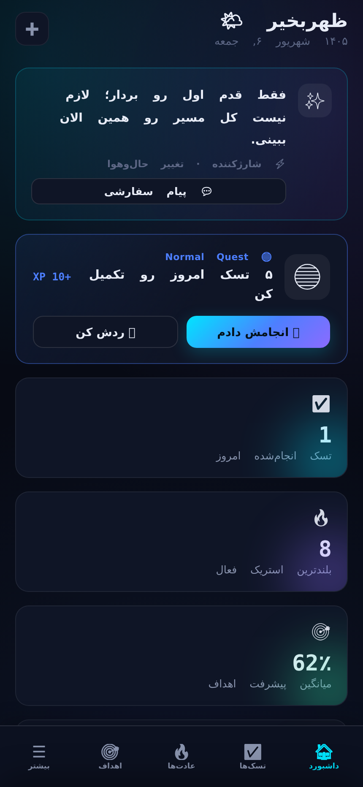
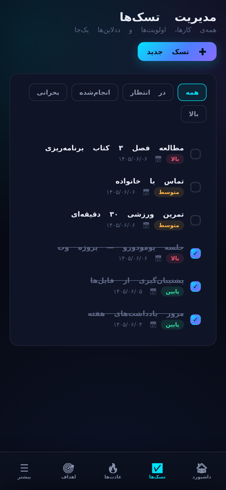
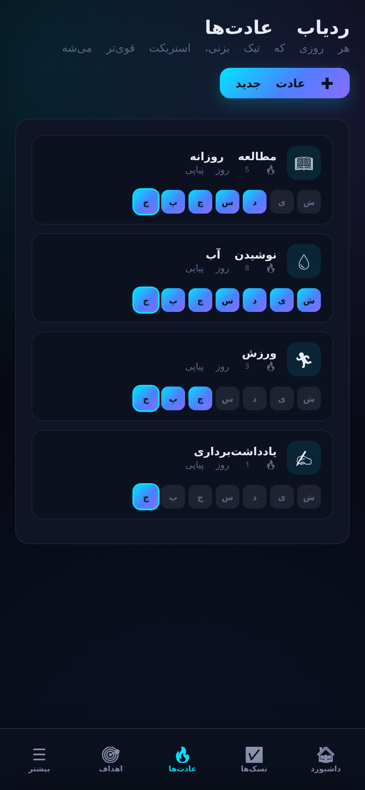
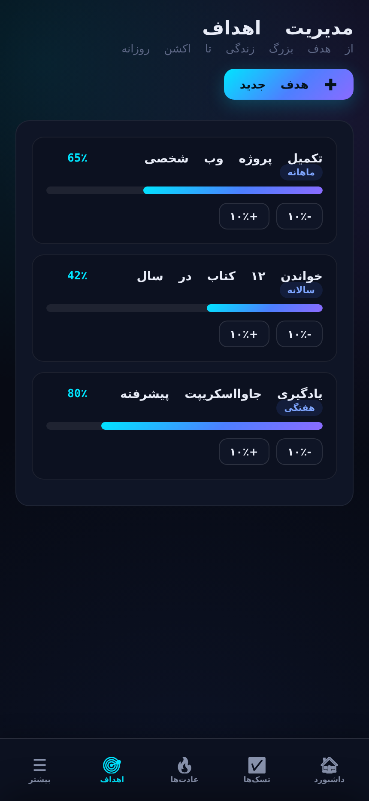
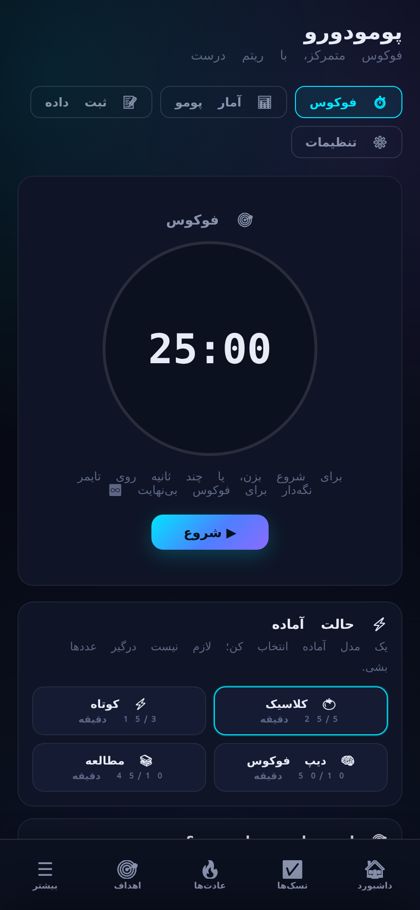
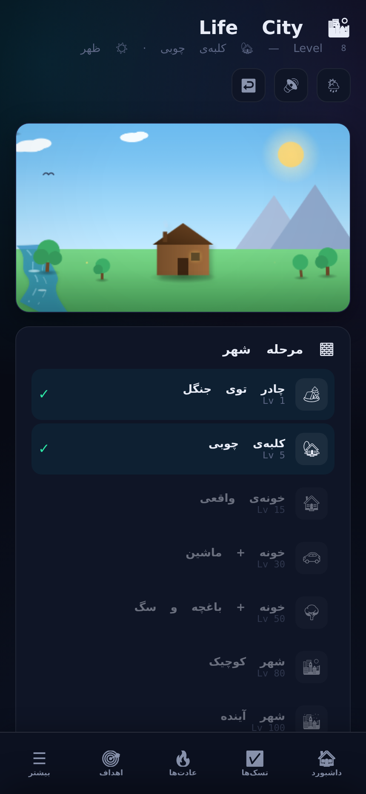
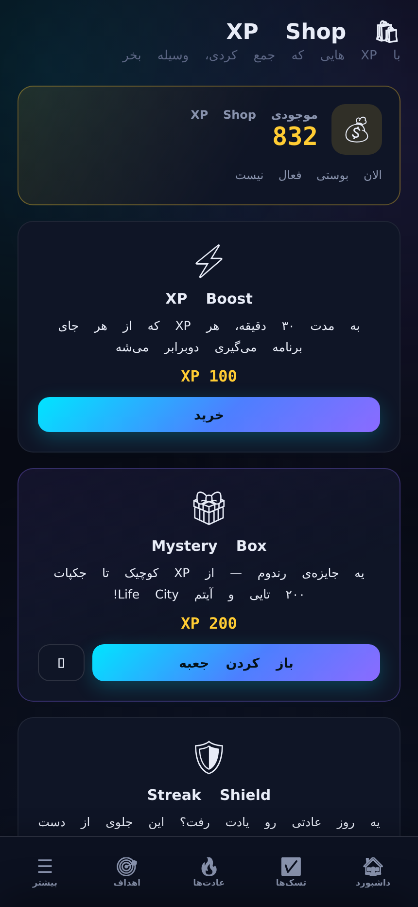

<div dir="rtl">

# 🌆 برنامه‌ریز هوشمند زندگی — Life Planner

یک **برنامه‌ریز شخصی فارسی** که کارهای روزانه، عادت‌ها، اهداف و پومودورو را با **گیمیفیکیشن** ترکیب کرده: با پیشرفت، شهری را می‌سازی، باس می‌گیری و با بهترین نسخه‌ی خودت رقابت می‌کنی.

- 📱 **PWA**: قابل نصب روی گوشی، **کاملاً آفلاین** کار می‌کند
- 🇮🇷 کاملاً **فارسی و راست‌به‌چپ** (RTL)
- ⚡ بدون هیچ وابستگی و بدون بیلد — فقط فایل‌های استاتیک
- 🔒 داده‌ها **فقط روی دستگاه کاربر** (localStorage)؛ هیچ سروری درگیر نیست

**نسخه فعلی: 12.1**

---

## 🖼️ نما

| داشبورد | تسک‌ها |
|---|---|
|  |  |

| عادت‌ها | اهداف |
|---|---|
|  |  |

| پومودورو | Life City |
|---|---|
|  |  |



---

## ✨ امکانات

### برنامه‌ریز
- ✅ **تسک‌ها** با اولویت (معمولی / بالا / فوری)، دسته، تاریخ و ددلاین‌های اضافی
- 🏷️ **وضعیت تسک (v10)**: شروع‌نشده / در حال انجام / در صف / متوقف — هم در فرم ویرایش و هم با یک ضربه از منوی جزئیات قابل تغییر است
- 📋 **منوی جزئیات تسک (v10)**: با ضربه روی هر تسک، اول اطلاعات مهم (اولویت، وضعیت، دسته، تاریخ، زمان تخمینی، یادداشت و پاداش‌ها) و بعد گزینه‌های انجام، ویرایش و حذف نمایش داده می‌شود — درست مثل رویدادهای تقویم
- 🧩 **زیرتسک‌ها (v10)**: هر تسک می‌تواند چند زیرتسک داشته باشد؛ با تیک زدن همه‌ی زیرتسک‌ها تسک اصلی خودکار انجام می‌شود و درصد پیشرفت روی همان تسک دیده می‌شود
- 🎲 **تسک تصادفی (v10)**: دکمه‌ی «رندوم» در بالای صفحه‌ی تسک‌ها، یکی از تسک‌های باز را (با در نظر گرفتن فیلتر فعال) انتخاب و باز می‌کند
- 🔥 **ردیاب عادت‌ها** با استریک (زنجیره‌ی پیاپی) و شبکه‌ی هفتگی
- 🎯 **اهداف** با سطح (روزانه تا مادام‌العمر) و درصد پیشرفت
- 📅 **تقویم هفتگی** با رویداد و یادآوری
- ✋ **کشیدن و رها کردن رویدادها (v12.1)**: رویداد را نگه دار و بکش تا به روز یا ساعت دیگری از هفته ببر؛ روز و ساعت رویداد خودکار به‌روز می‌شود (با اسنپ ۱۵ دقیقه‌ای و بررسی تداخل ساعت)
- ✏️ **ویرایش فقط یک روز از رویداد چندروزه (v12.1)**: با ضربه روی رویداد چندروزه، دو گزینه‌ی جدا از هم داری: «ویرایش فقط این روز» و «ویرایش کل رویداد (همه‌ی روزها)» — بقیه‌ی روزهای سری دست‌نخورده می‌مانند
- 🎨 **رنگ سفارشی رویداد/تسک و دسته‌بندی رنگی (v12.1)**: برای هر رویداد یا تسک رنگ دلخواه انتخاب کن؛ با دکمه‌ی «دسته‌ها» در تقویم، دسته‌ بساز و به آن رنگ پیش‌فرض بده — انتخاب آن دسته برای رویداد، رنگ دسته را خودکار می‌گیرد
- 📝 **یادداشت‌ها** با سنجاق کردن
- 🍅 **پومودورو و تمرکز پیشرفته (v11 — Focus To-Do Edition)**:
  - 🔄 **جلسات و دورهای فوکوس**: نمایش شفاف شماره جلسه و دور (دور ۱ • جلسه ۲ از ۴) همراه با نقطه‌های بصری پومودورو (🍅 🍅 ⚪ ⚪)
  - 🎧 **صداهای محیطی واقع‌گرایانه و باکیفیت**: سنتز صدای آفلاین باران و رعد، جنگل و چهچهه پرندگان، کافه دنج، امواج اقیانوس، آتش و شومینه، تیک‌تاک ساعت مکانیکی و فضای تمرکز عمیق همراه با اسلایدر بلندی صدا
  - ⏱️ **نمایش زنده و دقیق دقیقه فوکوس**: نشانگر لحظه‌ای «دقیقه X از Y» در حالت عادی و حالت تمرکز تمام‌صفحه
  - 🧠 **حالت تمرکز تمام‌صفحه اصلاح‌شده و زیبا**: محیط متمرکز، بدون لگ و سبک با کنترل‌های کامل درون صفحه و سازگار با هر ۵ تم
  - 📊 **آمار زمانی بر حسب ساعت و دقیقه**: نمایش مجموع زمان فوکوس و استراحت به فرمت فارسی «X ساعت و Y دقیقه» در کنار دقیقه‌ها
  - 🏖️ **استراحت طولانی خودکار**: ورود هوشمندانه به استراحت طولانی (۱۵ دقیقه) پس از تکمیل هر دور ۴ جلسه‌ای پومودورو
  - ✅ **تکمیل سریع تسک مرتبط**: امکان ثبت انجام تسک بلافاصله پس از اتمام جلسه فوکوس

### گیمیفیکیشن
- 🏙️ **Life City**: شهری که با هر سطح جدید بزرگ می‌شود (از کلبه‌ی چوبی تا شهر آینده)
- ⚔️ **باس هفتگی**: یک هدف بزرگ را به نبرد تبدیل کن
- 🪞 **You VS You**: مقایسه‌ی امروز با بهترین رکوردت و این هفته با هفته‌ی قبل
- 🌳 **درخت مهارت**: ارتقای XP، تخفیف فروشگاه، شانس جعبه و ...
- 🛍️ **XP Shop**: XP Boost، جعبه‌ی شگفت‌انگیز (Mystery Box)، سپر استریک
- ⚡ **مأموریت‌های روزانه** با تیئرهای Easy تا Special
- 🌟 **Perfect Day**: جشن وقتی همه‌چیز را کامل کردی
- 🚨 **حالت بحران**: شمارش معکوس وقتی عقب افتادی
- 🌧️ صدای محیط شهر (روز/شب/باران) و ۵ تم (تاریک، روشن + ۳ تم ویژه با XP)

### زیرساخت
- 📴 PWA با Service Worker: آفلاین کامل + **تشخیص خودکار آپدیت**
- ⭐ ۴ تم ویژه + اسکیل فونت و اسکیل رابط کاربری
- 💾 پشتیبان‌گیری و بازیابی + بکاپ خودکار
- 🔔 نوتیفیکیشن روزانه و یادآوری
- 🪶 **بهینه برای موبایل (v7.4)**: بلور شیشه‌ای سبک‌تر روی گوشی، حذف فیلترهای سنگین SVG شهر، رندر فقطِ نمای فعال و به‌روزرسانی زنده بدون بازسازی DOM — ظاهر همان است، فقط نرم‌تر و سبک‌تر
- 🪟 **باز شدن نرم منوی «بیشتر» (v8)**: حذف بلور زنده از پشت کشوی «بیشتر» — منو حالا بدون لگ و روان باز و بسته می‌شود؛ ظاهر شیشه‌ای همان است
- 🏙️ **ارتقای گرافیکی Life City (v9)**: آسمان پرجزئیات‌تر (پرتوهای خورشید، تپه‌های مه‌آلود)، جزئیات پشت‌بام‌های شهر و خطوط نئونی شهر آینده؛ آیتم‌های Mystery Box حالا به‌صورت اشیای واقعیِ وکتوری (درخت، نیمکت، چراغ، فواره، ساختمان) روی زمین شهر می‌نشینند — به‌همراه رفع رنگ‌بندی بلوک رویدادهای تقویم و فشرده‌ترشدن تقویم جلالی
- 🏠 **داشبوردِ تازه (v9.1)**: یک نوار Hero در بالا (سلام + سطح و نوار XP + حلقه‌ی پیشرفت کل + ۴ آمار سریع + ۴ میان‌بر: تسک جدید، تمرکز، عادت‌ها، تقویم) و بعد از آن کاشی‌های موزائیکی (مأموریت روزانه، برنامه‌ی امروز، استریک عادت‌ها، اهداف در جریان) که روی موبایل ستونی و روی صفحه‌ی بزرگ دو‌ستونه کنار هم می‌نشینند؛ فیلترهای بلور سنگینِ کارت‌های آماری حذف شده تا ظاهر تازه، سبک‌تر از قبل باشد
- ✅ **تسک‌های حرفه‌ای (v10)**: چهار وضعیت برای هر تسک (شروع‌نشده، در حال انجام، در صف، متوقف)، منوی جزئیات با نمایش پاداش تکمیل، زیرتسک با درصد پیشرفت و تکمیل خودکار، و دکمه‌ی انتخاب رندوم تسک — نسخه‌ی v10
- 🏷️ **فیلترهای کامل و نمای تمیز تسک‌ها (v10.2)**: فیلترهای نوار بالا با گزینه‌های «متوقف» و «شروع نشده» تکمیل شدند و ددلاین‌ها از پیش‌نمایش لیست تسک‌ها و داشبورد پنهان شدند تا ظاهر مینیمال و خلوت‌تر شود (مشاهده‌ی ددلاین و جزئیات کامل فقط با لمس تسک و باز شدن منوی جزئیات).
- 📅 **امروزِ هوشمند (v11.2)**: ددلاین‌های اضافی (Additional Deadlines) تسک‌ها هم حالا در برنامه‌ی امروزِ داشبورد (Today's Plan) به‌رسمیت شناخته می‌شوند — هر تسکی که ددلاین اصلی‌اش یا هرکدام از ددلاین‌های اضافی‌اش روی امروز باشد، در برنامه‌ی امروز نمایش داده می‌شود.
- 🍃 **پومودوروی واقعی (v11.1)**: صداهای محیطی باران، جنگل، کافه و آتش با فایل‌های MP3 واقعی جایگزین صداهای مصنوعی شدند (پخش حلقه‌ای، آفلاین، با کنترل بلندی)؛ تایمر حالت تمرکز تمام‌صفحه هم هر ۵۰۰ میلی‌ثانیه به‌روز می‌شود و دیگر روی یک عدد گیر نمی‌کند.

---

## 🚀 اجرا

فایل‌ها کاملاً استاتیک هستند. دو روش:

**روش ۱ — لوکال:** فقط `index.html` را در مرورگر باز کن. (برای نوتیفیکیشن و PWA بهتر است با یک سرور استاتیک اجرا شود؛ مثلاً `npx serve` یا `python3 -m http.server` در این پوشه.)

**روش ۲ — GitHub Pages:** این ریپو را فعال‌سازی GitHub Pages کن (منبع: شاخه‌ی `main`) و سایت در `<username>.github.io/Life-Planner` بالا می‌آید.

---

## 📁 ساختار پروژه

```
index.html            ← صفحه‌ی اصلی (فقط ساختار HTML؛ بدون کد و بدون CSS)
css/app.css           ← همه‌ی استایل‌ها
js/core.js            ← هسته: تم، مخزن داده (DB)، رندر، گیمیفیکیشن، آپدیت‌چک
js/enhancements.js    ← تنظیمات (فونت/UI/تم)، پشتیبان‌گیری، دیالوگ آپدیت
js/sw-register.js     ← ثبت Service Worker
js/pomodoro.js        ← ماژول پومودورو (IIFE مستقل، گلوبال نمی‌سازد)
sw.js                 ← Service Worker (کش آفلاین + آپدیت‌چک)
manifest.json         ← مانیفست PWA
app-version.json      ← نسخه‌ی برنامه برای آپدیت‌چک (تک منبع نسخه)
audio/                ← صداهای محیط شهر
legacy/               ← فایل‌های قدیمی و استفاده‌نشده (نگه‌داری فقط برای مرجع)
tests/app.test.mjs    ← تست کارکردی (اجرا: npm test)
ci/test.yml           ← workflow آماده‌ی CI (فعال‌سازی: زیر بخش «تست»)
```

**نکته‌ی مهم برای ویرایش‌ها:** ترتیب لود اسکریپت‌ها در `index.html` مهم است:
`core.js` → `enhancements.js` → `sw-register.js` → `pomodoro.js`.
همچنین چون HTML از handlerهای inline مثل `onclick="saveTask()"` استفاده می‌کند،
تابع‌های `core.js` باید در scope سراسری بمانند (ES module استفاده نکنید).

---

## 🔢 راهنمای تغییر نسخه (مهم)

وقتی آپدیت جدیدی می‌سازید، این کارها را انجام دهید:

1. `app-version.json` → `"version"` را یک واحد جلو ببرید (مثلاً 7.2 → 7.3).
2. در `js/core.js`، خط اولِ بخش `APP UPDATE CHECK` یعنی `const LP_APP_VERSION='...'` را هم همان عدد کنید.
3. اگر فایل‌های `css/` یا `js/` یا `sw.js` عوض شده‌اند، در `sw.js` شماره‌ی کش را
   یک واحد جلو ببرید: `const CACHE_NAME='life-planner-cache-v...'`.

با این کار، کاربرهای قدیمی به‌صورت خودکار پیام «نسخه‌ی جدید موجود است» را می‌بینند و کش تازه می‌شود.

---

## 🧪 تست

```bash
npm install
npm test
```

تست در یک مرورگر headless واقعی برنامه را بارگذاری می‌کند، تسک می‌سازد، کامل می‌کند،
بررسی می‌کند XP اضافه شده، داده بعد از ریلود باقی مانده، و صفحات اصلی بدون خطا رندر می‌شوند.
این تست در هر Push و Pull Request به `main` روی GitHub به‌صورت خودکار اجرا می‌شود.

**فعال‌سازی خودکار بودن (یک‌بار برای همیشه):** فایل `ci/test.yml` را به
`.github/workflows/test.yml` جابه‌جا کنید. اگر از طریق این Agent کار می‌کنید،
کافی است در GitHub مسیر `Settings → Apps` را باز کنید، برای اپلیکیشن Agent
دسترسی `workflows` را فعال کنید، و بگویید «CI را فعال کن» — خودش فایل را جابه‌جا می‌کند.

</div>

---

## English

**Smart Life Planner** — a fully Persian, RTL, offline-first PWA that combines a
daily planner (tasks, habits, goals, calendar, notes, pomodoro) with heavy
gamification: you grow a city (Life City), fight a weekly boss, spend XP in a
shop, and compete against your own best records (You VS You).

- Pure static site — no backend, no dependencies, no build step
- All user data stays on-device (localStorage)
- Service worker with offline cache + automatic update detection
- Functional test suite runs in CI on every push/PR to `main`

See the Persian section above for the full feature list, project structure and
versioning guide.
